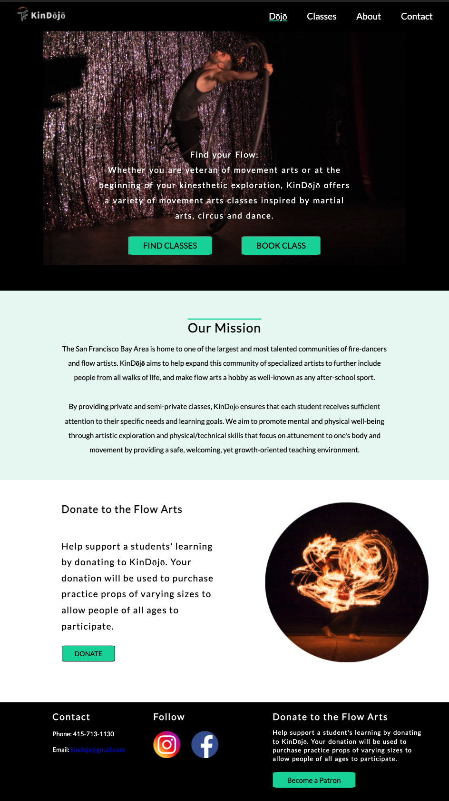
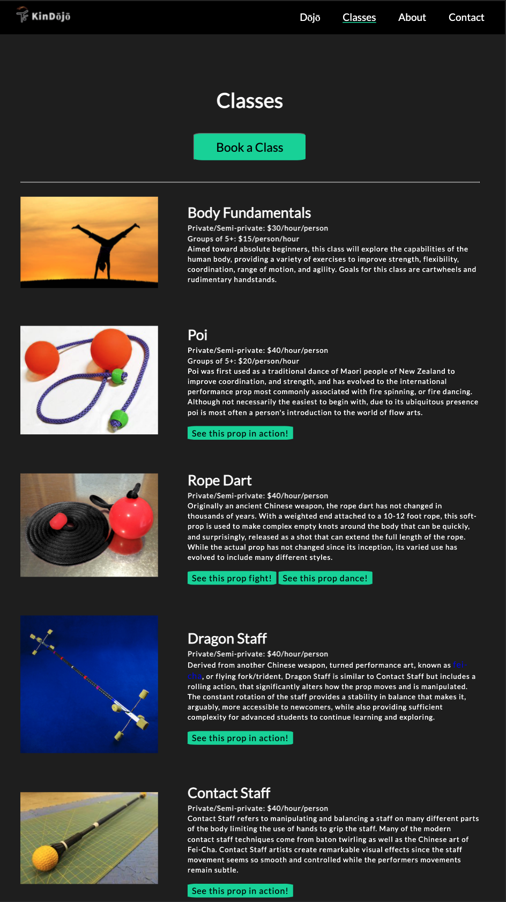

# KinDojo

 

A simple static multi-page website for a small business offering acrobatic and prop manipulation classes.  

Direct link to app: https://kindojo.netlify.app/

### Result:

This project allows a single individual or a small group to have an online presence for their business through which potential clients/users can easily read up on the classes available and book the one that suits them.

### Technologies used:

- HTML
- CSS
- Javascript

## Getting Started

Open the 'index.html' in your browser to view the website.

## Author
Nicholas Karsant
## License
This project is licensed under the MIT License - see the [LICENSE](LICENSE.md) file for details.